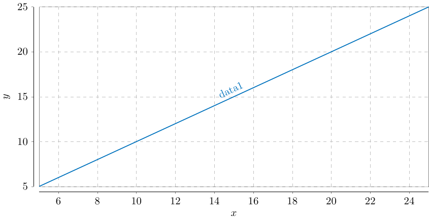
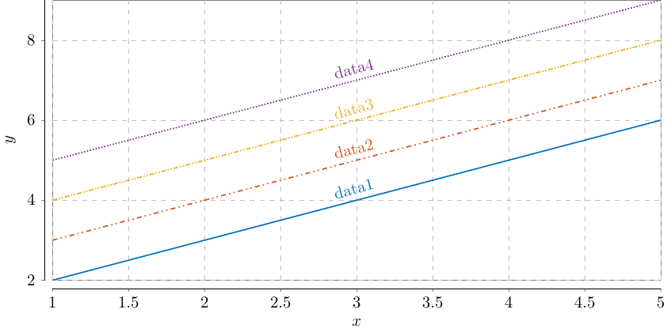

# tikz-fortran

A simple fortran module that generates figures using PGF/Tikz.

## Preview

|                                 |                                            |
| ---                             | ---                                        |
| `call tikz(z)`                  | `call tikz(x, y)` |
|      |                |
| `call tikz(z, legend = "Example")` | `call tikz(x, y, legend = "$+1$; $+2$; $+3$; $+4$ ")`|
|  |             |

## Installation

*Dependency*: [PGF/Tikz](https://www.ctan.org/tex-archive/graphics/pgf/)

I write this library to be *zero installation library*.
Simply copy and paste the `tikz_module.F90` into your project or library directory and it should be able to work by `use tikz_module`.

## Usage

### 2D plots

The full syntax is

```fortran
call tikz(x, y, title, xlabel, ylabel, legend, name, options)
```

- `x`: one dimensional array
- `y`: one or two dimensional array
- `title`: allocatable characters for figure title (optional)
- `xlabel`: allocatable characters for label on x-axis (optional)
- `ylabel`: allocatable characters for label on y-axis (optional)
- `legend`: allocatable characters that denotes legend that use semicolon (`;`) as delimiter
- `name`: file name for `.tex`, `.dat`, and `.pdf` file (optional)
- `options` see [options](#options)

The abbreviated syntax can be

```fortran
call tikz(y)        !! x is generated by linear spaced grid between minimum and maximum of y
call tikz(x, y)
```

### options

`options` are a `character` type that works to assign user-defined options to the generated tikz script.

Each category (`legend`, `color`, `marker`, etc) are separated by semicolor `;`, and each item under category is separated by comma `,`.

The delimiter between category (e.g. `legend`) and items (e.g. `box, north east`) is colon `:`.

Now it supports:

- `legend` or `le`: legend type and location
    - legend type: `line` or `box`, `line` means legend on the line, `box` means traditional legend
    - legend location: see [84.9.5 Legend Placement: Inside to the Data Visualization](https://tikz.dev/dv-stylesheets#sec-84.9.5)
- `color` or `c`: color of each line
- `linestyle` or `ls`: line style of each line, see [4.7.2Line Styles](https://tikz.dev/pgfplots/reference-markers#sec-4.7.2) for more detail

Examples:

```fortran
!! example: plot 2D with predetermined color
call tikz(x, y, name = 'tikzplot_4_col.tex', &
    options = 'color: gray, blue, orange, yellow')

!! example: plot 2D with legend in the box and box at north east
call tikz(x, y, name = 'tikzplot_4_le_box.tex', &
    options = 'legend: box, north east')

!! example: plot 2D with predetermined color, legend in the box, and legend at north east
call tikz(x, y, name = 'tikzplot_4_col_box.tex', &
    options = 'color: gray, blue, orange, yellow; &
              legend: box, north east')

!! example: plot 2D with marker
call tikz(x, y, name = './example/tikzplot_4_col_mark.tex', &
    options = 'color: gray, blue, orange, yellow; marker: true')
```

### 3D plots

See [pgfplots manual](https://tikz.dev/pgfplots/reference-3dplots#sec-4.6.1) for memory limitation of 3D plots.

- Support customization on `view` of the surface plots
- Support pre-defined [colormaps](https://tikz.dev/pgfplots/libs-colormaps)

The full syntax is

```fortran
call surf(x, y, z, title, xlabel, ylabel, zlabel, colormap, view, name, options)
```

The abbreviated syntax can be

```fortran
call surf(x, y, z)
```
All three inputs are necessary to create `meshgrid`.

### Groupplot

[`Groupplot`](https://tikz.dev/pgfplots/libs-groupplots) library has similar functionality to the `python`'s `plt.subplots` or `Matlab`'s `subplot` or `subfigure`.

The usage is less verbose to ordinary usage. The syntax is

```fortran
call groupplot(2, 1)    !! 2 rows, 1 column
call tikz(x)
call tikz(z)            !! needs to have rows*columns figures, otherwise it won't compile
call groupplot          !! stop the groupplot
```


## PGF/Tikz templated used

The `Sloped` section of template comes from [stack overflow](https://tex.stackexchange.com/a/184242), which allows me to put legend along the slope at the function.

```tex
\documentclass[tikz]{standalone}
\usepackage{tikz}
\usepackage{pgfplots}
\usetikzlibrary{decorations}
\usetikzlibrary{decorations.pathreplacing, intersections, fillbetween}
\usetikzlibrary{calc,positioning}
\usetikzlibrary{plotmarks}
\pgfplotsset{compat=newest, scale only axis, width = 13cm, height = 6cm}

% Create fake \onslide and other commands for standalone picture
\usepackage{xparse}
\NewDocumentCommand{\onslide}{s t+ d<>}{}
\NewDocumentCommand{\only}{d<>}{}
\NewDocumentCommand{\uncover}{d<>}{}
\NewDocumentCommand{\visible}{d<>}{}
\NewDocumentCommand{\invisible}{d<>}{}

% ---------------------------------------------------------------------
% Create sloped legend on the data line
\makeatletter
\tikzset{
Sloped/.code = {
\iftikz@fullytransformed% tikz.code.tex
    \tikzset{sloped}
\else
    \pgfgettransformentries{\mya}{\myb}{\myc}{\myd}{\mys}{\myt}%
    \tikzset{sloped, transform shape, rotate = {atan2(\myb,\mya)}}%
\fi
}
}
\makeatother
% ---------------------------------------------------------------------

% ---------------------------------------------------------------------
% Coordinate extraction
% #1: node name
% #2: output macro name: x coordinate
% #3: output macro name: y coordinate
\newcommand{\Getxycoords}[3]{%
    \pgfplotsextra{%
        % using `\pgfplotspointgetcoordinates' stores the (axis)
        % coordinates in `data point' which then can be called by
        % `\pgfkeysvalueof' or `\pgfkeysgetvalue'
        \pgfplotspointgetcoordinates{(#1)}%
        % `\global' (a TeX macro and not a TikZ/PGFPlots one) allows to
        % store the values globally
         \global\pgfkeysgetvalue{/data point/x}{#2}%
         \global\pgfkeysgetvalue{/data point/y}{#3}%
     }%
}
% ---------------------------------------------------------------------

\definecolor{blue}{HTML}{0072BD}
\definecolor{orange}{HTML}{D95319}
\definecolor{yellow}{HTML}{EDB120}
\definecolor{purple}{HTML}{7E2F8E}
\definecolor{green}{HTML}{77AC30}
\definecolor{light-blue}{HTML}{4DBEEE}
\definecolor{red}{HTML}{A2142F}

\begin{document}

\begin{tikzpicture}

\begin{axis}[
    axis lines=left,
    axis line style={-,very thin},
    axis background/.style={draw,ultra thin,gray},
    tick align=outside,
    grid=both,
    major grid style={line width=.2pt,draw=gray!50, dashed},
    axis x line shift=0.5em,
    axis y line shift=0.5em,
    xticklabel style={
        /pgf/number format/fixed,
        /pgf/number format/precision=2
    },
    yticklabel style={
        /pgf/number format/fixed,
        /pgf/number format/precision=2
    },
    scaled y ticks=false,
    major tick length=2pt,
    xlabel = {<assigned by tikz-fortran>},
    ylabel = {<assigned by tikz-fortran>},
    xmin = <assigned by tikz-fortran>,
    xmax = <assigned by tikz-fortran>,
    ymin = <assigned by tikz-fortran>,
    ymax = <assigned by tikz-fortran>,
    legend cell align = left,
    legend pos = <assigned by tikz-fortran>,
    title = {<assigned by tikz-fortran>}]


\addplot[name path = 1, thick, solid, color=blue] table [x expr=\thisrowno{0}, y expr=\thisrowno{1}]{tikzplot_4_le_box.dat};
\addlegendentry{data1}
\addplot[name path = 2, thick, dashdotdotted, color=orange] table [x expr=\thisrowno{0}, y expr=\thisrowno{2}]{tikzplot_4_le_box.dat};
\addlegendentry{data2}
\addplot[name path = 3, thick, densely dashdotdotted, color=yellow] table [x expr=\thisrowno{0}, y expr=\thisrowno{3}]{tikzplot_4_le_box.dat};
\addlegendentry{data3}
\addplot[name path = 4, thick, densely dotted, color=purple] table [x expr=\thisrowno{0}, y expr=\thisrowno{4}]{tikzplot_4_le_box.dat};
\addlegendentry{data4}


\end{axis}


\end{tikzpicture}

\end{document}
```

## Example

Run `fpm run --example` or `gfortran -o run src/tikz_module.F90 example/example.f90 && ./run ` to see examples.

